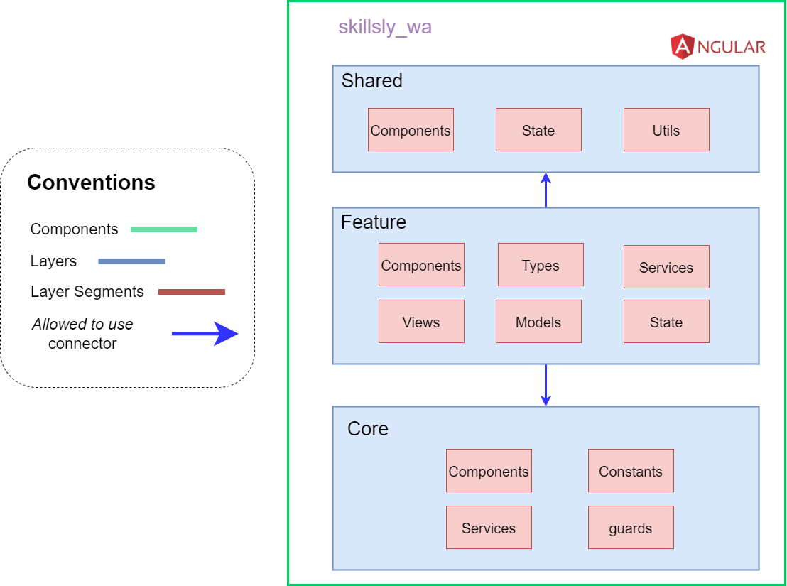

# Skillsly Web Frontend - Enhanced

Web component that provides a GUI for users to interact with Skillsly (Microservices architecture version).
This component consumes backend's GraphQL API through the GrahpQL Client provided by Angular.

The layer structure of this component is the following:

**Core**: Includes the elements available in all layers and defined from the root 
of the application:  
- ***Component*** **Segment**: Global Angular components of the interface (navigation bar, page, etc).
- ***Constants*** **Segment**: Contains the constants used throughout the application.
- ***Guards*** **Segment**: Contains the guards applied to the application routes.
- ***Services*** **Segment**: Contains the services that can be used in any part of the application.

**Feature**: Includes each context, i.e. the separation of the business domain
by functionalities. Defines the following segments and exposes some of its
elements to other contexts via Angular modules:  
- ***Component*** **Segment**: Angular components specific to the functionality.
- ***Types*** **Segment**: Entities, interfaces, presenters, and other types.
- ***Services*** **Segment**: GraphQL services specific to the functionality.
- ***Views*** **Segment**: Angular components that define the main views or pages of the
application.
- ***Model*** **Segment**: Interfaces that define the models of the state managers.
- ***State*** **Segment**: Classes that handle shared state between components
of the same functionality.

**Shared**: Includes the common elements that can be used by the different contexts:  
- ***Components*** **Segment**: Defines components that can be used by the modules of
the different contexts or functionalities.
- ***State*** **Segment**: Defines the global states that can be used by the different
contexts or functionalities.
- ***Utils*** **Segment**: Defines programmatic utility elements that are available to
the different contexts.

A video showcasing the web and mobile components: [Skillsly Showcase]()
